<!-- README.md is generated from README.Rmd. Please edit that file -->

```{r, include = FALSE}
knitr::opts_chunk$set(
  collapse = TRUE,
  comment = "#>",
  fig.path = "man/figures/README-",
  out.width = "100%"
)
```
[ucar]:https://www.ncl.ucar.edu/Document/Graphics/ColorTables

# rcolormap: 270 ncl colormaps in R

<!-- badges: start -->
[](https://ci.appveyor.com/project/kongdd/rcolormap)
[](https://travis-ci.com/kongdd/rcolors)
[](https://codecov.io/gh/kongdd/rcolors?branch=master)
[](https://github.com/kongdd/rcolormap/actions)
<!-- badges: end -->

## Installation
``` r
devtools::install_github("kongdd/rcolors")
```

## Example

This is a basic example which shows you how to use `rcolors`:

```{r get_color, fig.height=0.3, fig.width=7}
library(rcolors)
rcolors$amwg_blueyellowred %>% show_cols()
get_color("amwg_blueyellowred", n = 20)
```
```{r show_cols, fig.height=8, fig.width=7}
print(names(rcolors2))
show_cols(rcolors2$rainbow, margin = 14)
```


# Color Table Gallery

[about color tables](https://www.ncl.ucar.edu/Document/Graphics/color_tables.shtml) | [named colors](https://www.ncl.ucar.edu/Document/Graphics/named_colors.shtml)

| [Rainbow](#rainbow)                         | [Small rainbow](#small-rainbow) | [Earth/Ocean](#Earth_Ocean)    | [Oceanography](#Oceanography)   | [Aid in color blindness](#Aid_in_color_blindness) |
| ----------------------                      | ------------------------------  | ------------------------------ | ------------------------------- | ----------------------------| 
| [MeteoSwiss](#MeteoSwiss)                   | [Blue/Red](#Blue_Red)    | [Blue/Green](#Blue_Green)    | [Red/Orange](#Red_Orange)    | [Red/Green](#Red_Green) |
| [Green/Yellow](#Green_Yellow)               | [Red/Purple](#Red_Purple)    | [Blue/Purple](#Blue_Purple)    | [Green/Purple](#Green_Purple)    | [Brown/Copper](#Brown_Copper) |
| [Blue/Yellow/Red](#Blue_Yellow_Red)         | [Blue](#Blue)    | [Purple](#Purple)    | [Green](#Green)    | [Gray](#Gray) |
| [Banded](#Banded)                           | [Faded](#Faded)    | [Circular](#Circular)    | [Miscellaneous](#Miscellaneous)    | [Vegetation](#Vegetation) |
| [White-in-the-middle](#White-in-the-middle) | [Starts-with-white](#Starts-with-white)    | [GMT](#GMT)    | [GrADS](#GrADS)    | [matplotlib](#matplotlib) |
| [Ncview](#Ncview)                           | [SVG](#SVG)    | [ColorBrewer](#ColorBrewer) |      |                                                              |      |    |

## Rainbow

|amwg256<br>[](ucar/amwg256.shtml) n=254| BkBlAqGrYeOrReViWh200<br>[](https://www.ncl.ucar.edu/Document/Graphics/ColorTables/BkBlAqGrYeOrReViWh200.shtml) n=200| BlAqGrYeOrRe<br>[](https://www.ncl.ucar.edu/Document/Graphics/ColorTables/BlAqGrYeOrRe.shtml) n=100| BlAqGrYeOrReVi200<br>[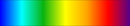](https://www.ncl.ucar.edu/Document/Graphics/ColorTables/BlAqGrYeOrReVi200.shtml) n=200|
| ------------------------------------------------------------ | ------------------------------------------------------------ | ------------------------------------------------------------ | ------------------------------------------------------------ |
| BlGrYeOrReVi200<br>[](https://www.ncl.ucar.edu/Document/Graphics/ColorTables/BlGrYeOrReVi200.shtml) n=200| example<br>[](https://www.ncl.ucar.edu/Document/Graphics/ColorTables/example.shtml) n=113| GMT_seis<br>[](https://www.ncl.ucar.edu/Document/Graphics/ColorTables/GMT_seis.shtml) n=256| GMT_wysiwygcont<br>[](https://www.ncl.ucar.edu/Document/Graphics/ColorTables/GMT_wysiwygcont.shtml) n=200|
| matlab_hsv<br>[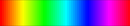](https://www.ncl.ucar.edu/Document/Graphics/ColorTables/matlab_hsv.shtml) n=64| matlab_jet<br>[](https://www.ncl.ucar.edu/Document/Graphics/ColorTables/matlab_jet.shtml) n=64| MPL_gist_ncar<br>[](https://www.ncl.ucar.edu/Document/Graphics/ColorTables/MPL_gist_ncar.shtml) n=128| MPL_gist_rainbow<br>[](https://www.ncl.ucar.edu/Document/Graphics/ColorTables/MPL_gist_rainbow.shtml) n=128|
| MPL_hsv<br>[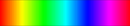](https://www.ncl.ucar.edu/Document/Graphics/ColorTables/MPL_hsv.shtml) n=128| MPL_jet<br>[](https://www.ncl.ucar.edu/Document/Graphics/ColorTables/MPL_jet.shtml) n=128| MPL_rainbow<br>[](https://www.ncl.ucar.edu/Document/Graphics/ColorTables/MPL_rainbow.shtml) n=128| MPL_Spectral<br>[](https://www.ncl.ucar.edu/Document/Graphics/ColorTables/MPL_Spectral.shtml) n=128|
| NCV_bright<br>[](https://www.ncl.ucar.edu/Document/Graphics/ColorTables/NCV_bright.shtml) n=256| NCV_jaisnd<br>[](https://www.ncl.ucar.edu/Document/Graphics/ColorTables/NCV_jaisnd.shtml) n=256| NCV_jet<br>[](https://www.ncl.ucar.edu/Document/Graphics/ColorTables/NCV_jet.shtml) n=256| NCV_rainbow2<br>[](https://www.ncl.ucar.edu/Document/Graphics/ColorTables/NCV_rainbow2.shtml) n=256|
| ncview_default<br>[](https://www.ncl.ucar.edu/Document/Graphics/ColorTables/ncview_default.shtml) n=254| nice_gfdl<br>[](https://www.ncl.ucar.edu/Document/Graphics/ColorTables/nice_gfdl.shtml) n=225| rainbow<br>[](https://www.ncl.ucar.edu/Document/Graphics/ColorTables/rainbow.shtml) n=188| rainbow+gray<br>[](https://www.ncl.ucar.edu/Document/Graphics/ColorTables/rainbow+gray.shtml) n=237|
| rainbow+white<br>[](https://www.ncl.ucar.edu/Document/Graphics/ColorTables/rainbow+white.shtml) n=237| rainbow+white+gray<br>[](https://www.ncl.ucar.edu/Document/Graphics/ColorTables/rainbow+white+gray.shtml) n=238| tbr_240-300<br>[](https://www.ncl.ucar.edu/Document/Graphics/ColorTables/tbr_240-300.shtml) n=200| tbr_stdev_0-30<br>[](https://www.ncl.ucar.edu/Document/Graphics/ColorTables/tbr_stdev_0-30.shtml) n=200|
| tbr_var_0-500<br>[](https://www.ncl.ucar.edu/Document/Graphics/ColorTables/tbr_var_0-500.shtml) n=200| tbrAvg1<br>[](https://www.ncl.ucar.edu/Document/Graphics/ColorTables/tbrAvg1.shtml) n=100| tbrStd1<br>[](https://www.ncl.ucar.edu/Document/Graphics/ColorTables/tbrStd1.shtml) n=101| tbrVar1<br>[](https://www.ncl.ucar.edu/Document/Graphics/ColorTables/tbrVar1.shtml) n=101|
| temp1<br>[](https://www.ncl.ucar.edu/Document/Graphics/ColorTables/temp1.shtml) n=61| testcmap<br>[](https://www.ncl.ucar.edu/Document/Graphics/ColorTables/testcmap.shtml) n=199| ViBlGrWhYeOrRe<br>[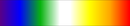](https://www.ncl.ucar.edu/Document/Graphics/ColorTables/ViBlGrWhYeOrRe.shtml) n=101| wh-bl-gr-ye-re<br>[](https://www.ncl.ucar.edu/Document/Graphics/ColorTables/wh-bl-gr-ye-re.shtml) n=199|
| WhBlGrYeRe<br>[](https://www.ncl.ucar.edu/Document/Graphics/ColorTables/WhBlGrYeRe.shtml) n=100| WhiteBlueGreenYellowRed<br>[](https://www.ncl.ucar.edu/Document/Graphics/ColorTables/WhiteBlueGreenYellowRed.shtml) n=254| WhViBlGrYeOrRe<br>[](https://www.ncl.ucar.edu/Document/Graphics/ColorTables/WhViBlGrYeOrRe.shtml) n=101| WhViBlGrYeOrReWh<br>[](https://www.ncl.ucar.edu/Document/Graphics/ColorTables/WhViBlGrYeOrReWh.shtml) n=101|


## Small rainbow 

| amwg<br>[](https://www.ncl.ucar.edu/Document/Graphics/ColorTables/amwg.shtml) n=16| BlAqGrWh2YeOrReVi22<br>[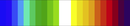](https://www.ncl.ucar.edu/Document/Graphics/ColorTables/BlAqGrWh2YeOrReVi22.shtml) n=22| cosam<br>[](https://www.ncl.ucar.edu/Document/Graphics/ColorTables/cosam.shtml) n=10| cosam12<br>[](https://www.ncl.ucar.edu/Document/Graphics/ColorTables/cosam12.shtml) n=12|
| ------------------------------------------------------------ | ------------------------------------------------------------ | ------------------------------------------------------------ | ------------------------------------------------------------ |
| cyclic<br>[](https://www.ncl.ucar.edu/Document/Graphics/ColorTables/cyclic.shtml) n=6| GHRSST_anomaly<br>[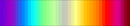](https://www.ncl.ucar.edu/Document/Graphics/ColorTables/GHRSST_anomaly.shtml) n=42| GMT_wysiwyg<br>[](https://www.ncl.ucar.edu/Document/Graphics/ColorTables/GMT_wysiwyg.shtml) n=20| grads_rainbow<br>[](https://www.ncl.ucar.edu/Document/Graphics/ColorTables/grads_rainbow.shtml) n=13|
| gui_default<br>[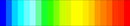](https://www.ncl.ucar.edu/Document/Graphics/ColorTables/gui_default.shtml) n=22| prcp_1<br>[](https://www.ncl.ucar.edu/Document/Graphics/ColorTables/prcp_1.shtml) n=17| prcp_2<br>[](https://www.ncl.ucar.edu/Document/Graphics/ColorTables/prcp_2.shtml) n=12| prcp_3<br>[](https://www.ncl.ucar.edu/Document/Graphics/ColorTables/prcp_3.shtml) n=23|
| radar<br>[](https://www.ncl.ucar.edu/Document/Graphics/ColorTables/radar.shtml) n=15| radar_1<br>[](https://www.ncl.ucar.edu/Document/Graphics/ColorTables/radar_1.shtml) n=24| seaice_1<br>[](https://www.ncl.ucar.edu/Document/Graphics/ColorTables/seaice_1.shtml) n=13| seaice_2<br>[](https://www.ncl.ucar.edu/Document/Graphics/ColorTables/seaice_2.shtml) n=14|
| so4_21<br>[](https://www.ncl.ucar.edu/Document/Graphics/ColorTables/so4_21.shtml) n=21| so4_23<br>[](https://www.ncl.ucar.edu/Document/Graphics/ColorTables/so4_23.shtml) n=23| wgne15<br>[](https://www.ncl.ucar.edu/Document/Graphics/ColorTables/wgne15.shtml) n=15|                                                              |


## Earth/Ocean 

| cmocean_deep<br>[](https://www.ncl.ucar.edu/Document/Graphics/ColorTables/cmocean_deep.shtml) n=256| cmp_haxby<br>[](https://www.ncl.ucar.edu/Document/Graphics/ColorTables/cmp_haxby.shtml) n=64| GMT_drywet<br>[](https://www.ncl.ucar.edu/Document/Graphics/ColorTables/GMT_drywet.shtml) n=60| GMT_globe<br>[](https://www.ncl.ucar.edu/Document/Graphics/ColorTables/GMT_globe.shtml) n=256|
| ------------------------------------------------------------ | ------------------------------------------------------------ | ------------------------------------------------------------ | ------------------------------------------------------------ |
| GMT_haxby<br>[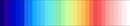](https://www.ncl.ucar.edu/Document/Graphics/ColorTables/GMT_haxby.shtml) n=32| GMT_nighttime<br>[](https://www.ncl.ucar.edu/Document/Graphics/ColorTables/GMT_nighttime.shtml) n=20| GMT_ocean<br>[](https://www.ncl.ucar.edu/Document/Graphics/ColorTables/GMT_ocean.shtml) n=80| GMT_relief<br>[](https://www.ncl.ucar.edu/Document/Graphics/ColorTables/GMT_relief.shtml) n=256|
| GMT_relief_oceanonly<br>[](https://www.ncl.ucar.edu/Document/Graphics/ColorTables/GMT_relief_oceanonly.shtml) n=160| GMT_topo<br>[](https://www.ncl.ucar.edu/Document/Graphics/ColorTables/GMT_topo.shtml) n=256| MPL_BrBG<br>[](https://www.ncl.ucar.edu/Document/Graphics/ColorTables/MPL_BrBG.shtml) n=128| MPL_gist_earth<br>[](https://www.ncl.ucar.edu/Document/Graphics/ColorTables/MPL_gist_earth.shtml) n=128|
| MPL_ocean<br>[](https://www.ncl.ucar.edu/Document/Graphics/ColorTables/MPL_ocean.shtml) n=128| MPL_terrain<br>[](https://www.ncl.ucar.edu/Document/Graphics/ColorTables/MPL_terrain.shtml) n=128| NCV_gebco<br>[](https://www.ncl.ucar.edu/Document/Graphics/ColorTables/NCV_gebco.shtml) n=24| OceanLakeLandSnow<br>[](https://www.ncl.ucar.edu/Document/Graphics/ColorTables/OceanLakeLandSnow.shtml) n=254|
| topo_15lev<br>[](https://www.ncl.ucar.edu/Document/Graphics/ColorTables/topo_15lev.shtml) n=16|                                                              |                                                              |                                                              |


## Oceanography 

| cmocean_algae<br>[](https://www.ncl.ucar.edu/Document/Graphics/ColorTables/cmocean_algae.shtml) n=256| cmocean_amp<br>[](https://www.ncl.ucar.edu/Document/Graphics/ColorTables/cmocean_amp.shtml) n=256| cmocean_balance<br>[](https://www.ncl.ucar.edu/Document/Graphics/ColorTables/cmocean_balance.shtml) n=256| cmocean_curl<br>[](https://www.ncl.ucar.edu/Document/Graphics/ColorTables/cmocean_curl.shtml) n=256|
| ------------------------------------------------------------ | ------------------------------------------------------------ | ------------------------------------------------------------ | ------------------------------------------------------------ |
| cmocean_deep<br>[](https://www.ncl.ucar.edu/Document/Graphics/ColorTables/cmocean_deep.shtml) n=256| cmocean_delta<br>[](https://www.ncl.ucar.edu/Document/Graphics/ColorTables/cmocean_delta.shtml) n=256| cmocean_dense<br>[](https://www.ncl.ucar.edu/Document/Graphics/ColorTables/cmocean_dense.shtml) n=256| cmocean_gray<br>[](https://www.ncl.ucar.edu/Document/Graphics/ColorTables/cmocean_gray.shtml) n=256|
| cmocean_haline<br>[](https://www.ncl.ucar.edu/Document/Graphics/ColorTables/cmocean_haline.shtml) n=256| cmocean_ice<br>[](https://www.ncl.ucar.edu/Document/Graphics/ColorTables/cmocean_ice.shtml) n=256| cmocean_matter<br>[](https://www.ncl.ucar.edu/Document/Graphics/ColorTables/cmocean_matter.shtml) n=256| cmocean_oxy<br>[](https://www.ncl.ucar.edu/Document/Graphics/ColorTables/cmocean_oxy.shtml) n=256|
| cmocean_phase<br>[](https://www.ncl.ucar.edu/Document/Graphics/ColorTables/cmocean_phase.shtml) n=256| cmocean_solar<br>[](https://www.ncl.ucar.edu/Document/Graphics/ColorTables/cmocean_solar.shtml) n=256| cmocean_speed<br>[](https://www.ncl.ucar.edu/Document/Graphics/ColorTables/cmocean_speed.shtml) n=256| cmocean_tempo<br>[](https://www.ncl.ucar.edu/Document/Graphics/ColorTables/cmocean_tempo.shtml) n=256|
| cmocean_thermal<br>[](https://www.ncl.ucar.edu/Document/Graphics/ColorTables/cmocean_thermal.shtml) n=256| cmocean_turbid<br>[](https://www.ncl.ucar.edu/Document/Graphics/ColorTables/cmocean_turbid.shtml) n=256|                                                              |                                                              |


## Aid in color blindness 

| BlueDarkOrange18<br>[](https://www.ncl.ucar.edu/Document/Graphics/ColorTables/BlueDarkOrange18.shtml) n=18| BlueDarkRed18<br>[](https://www.ncl.ucar.edu/Document/Graphics/ColorTables/BlueDarkRed18.shtml) n=18| BlueGreen14<br>[](https://www.ncl.ucar.edu/Document/Graphics/ColorTables/BlueGreen14.shtml) n=14| BrownBlue12<br>[](https://www.ncl.ucar.edu/Document/Graphics/ColorTables/BrownBlue12.shtml) n=12|
| ------------------------------------------------------------ | ------------------------------------------------------------ | ------------------------------------------------------------ | ------------------------------------------------------------ |
| Cat12<br>[](https://www.ncl.ucar.edu/Document/Graphics/ColorTables/Cat12.shtml) n=12| cb_9step<br>[](https://www.ncl.ucar.edu/Document/Graphics/ColorTables/cb_9step.shtml) n=78| cb_rainbow<br>[](https://www.ncl.ucar.edu/Document/Graphics/ColorTables/cb_rainbow.shtml) n=241| cb_rainbow_inv<br>[](https://www.ncl.ucar.edu/Document/Graphics/ColorTables/cb_rainbow_inv.shtml) n=241|
| CBR_coldhot<br>[](https://www.ncl.ucar.edu/Document/Graphics/ColorTables/CBR_coldhot.shtml) n=11| CBR_drywet<br>[](https://www.ncl.ucar.edu/Document/Graphics/ColorTables/CBR_drywet.shtml) n=11| CBR_wet<br>[](https://www.ncl.ucar.edu/Document/Graphics/ColorTables/CBR_wet.shtml) n=11| cividis<br>[](https://www.ncl.ucar.edu/Document/Graphics/ColorTables/cividis.shtml) n=256|
| GreenMagenta16<br>[](https://www.ncl.ucar.edu/Document/Graphics/ColorTables/GreenMagenta16.shtml) n=16| posneg_1<br>[](https://www.ncl.ucar.edu/Document/Graphics/ColorTables/posneg_1.shtml) n=19| posneg_2<br>[](https://www.ncl.ucar.edu/Document/Graphics/ColorTables/posneg_2.shtml) n=20| srip_reanalysis<br>[](https://www.ncl.ucar.edu/Document/Graphics/ColorTables/srip_reanalysis.shtml) n=19|
| StepSeq25<br>[](https://www.ncl.ucar.edu/Document/Graphics/ColorTables/StepSeq25.shtml) n=25|                                                              |                                                              |                                                              |


## [MeteoSwiss](http://www.meteoswiss.ch/) 

| hotcold_18lev<br>[](https://www.ncl.ucar.edu/Document/Graphics/ColorTables/hotcold_18lev.shtml) n=19| hotcolr_19lev<br>[](https://www.ncl.ucar.edu/Document/Graphics/ColorTables/hotcolr_19lev.shtml) n=20| mch_default<br>[](https://www.ncl.ucar.edu/Document/Graphics/ColorTables/mch_default.shtml) n=15| perc2_9lev<br>[](https://www.ncl.ucar.edu/Document/Graphics/ColorTables/perc2_9lev.shtml) n=10|
| ------------------------------------------------------------ | ------------------------------------------------------------ | ------------------------------------------------------------ | ------------------------------------------------------------ |
| percent_11lev<br>[](https://www.ncl.ucar.edu/Document/Graphics/ColorTables/percent_11lev.shtml) n=12| precip2_15lev<br>[](https://www.ncl.ucar.edu/Document/Graphics/ColorTables/precip2_15lev.shtml) n=16| precip2_17lev<br>[](https://www.ncl.ucar.edu/Document/Graphics/ColorTables/precip2_17lev.shtml) n=18| precip3_16lev<br>[](https://www.ncl.ucar.edu/Document/Graphics/ColorTables/precip3_16lev.shtml) n=17|
| precip4_11lev<br>[](https://www.ncl.ucar.edu/Document/Graphics/ColorTables/precip4_11lev.shtml) n=12| precip4_diff_19lev<br>[](https://www.ncl.ucar.edu/Document/Graphics/ColorTables/precip4_diff_19lev.shtml) n=20| precip_11lev<br>[](https://www.ncl.ucar.edu/Document/Graphics/ColorTables/precip_11lev.shtml) n=12| precip_diff_12lev<br>[](https://www.ncl.ucar.edu/Document/Graphics/ColorTables/precip_diff_12lev.shtml) n=13|
| precip_diff_1lev<br>[](https://www.ncl.ucar.edu/Document/Graphics/ColorTables/precip_diff_1lev.shtml) n=2| rh_19lev<br>[](https://www.ncl.ucar.edu/Document/Graphics/ColorTables/rh_19lev.shtml) n=20| spread_15lev<br>[](https://www.ncl.ucar.edu/Document/Graphics/ColorTables/spread_15lev.shtml) n=16| sunshine_9lev<br>[](https://www.ncl.ucar.edu/Document/Graphics/ColorTables/sunshine_9lev.shtml) n=10|
| sunshine_diff_12lev<br>[](https://www.ncl.ucar.edu/Document/Graphics/ColorTables/sunshine_diff_12lev.shtml) n=13| t2m_29lev<br>[](https://www.ncl.ucar.edu/Document/Graphics/ColorTables/t2m_29lev.shtml) n=30| temp_19lev<br>[](https://www.ncl.ucar.edu/Document/Graphics/ColorTables/temp_19lev.shtml) n=20| temp_diff_18lev<br>[](https://www.ncl.ucar.edu/Document/Graphics/ColorTables/temp_diff_18lev.shtml) n=19|
| temp_diff_1lev<br>[](https://www.ncl.ucar.edu/Document/Graphics/ColorTables/temp_diff_1lev.shtml) n=2| topo_15lev<br>[](https://www.ncl.ucar.edu/Document/Graphics/ColorTables/topo_15lev.shtml) n=16| wind_17lev<br>[](https://www.ncl.ucar.edu/Document/Graphics/ColorTables/wind_17lev.shtml) n=18|                                                              |


## Blue/Red 

| BlRe<br>[](https://www.ncl.ucar.edu/Document/Graphics/ColorTables/BlRe.shtml) n=96| BlueDarkRed18<br>[](https://www.ncl.ucar.edu/Document/Graphics/ColorTables/BlueDarkRed18.shtml) n=18| BlueRed<br>[](https://www.ncl.ucar.edu/Document/Graphics/ColorTables/BlueRed.shtml) n=252| BlueRedGray<br>[](https://www.ncl.ucar.edu/Document/Graphics/ColorTables/BlueRedGray.shtml) n=253|
| ------------------------------------------------------------ | ------------------------------------------------------------ | ------------------------------------------------------------ | ------------------------------------------------------------ |
| BlWhRe<br>[](https://www.ncl.ucar.edu/Document/Graphics/ColorTables/BlWhRe.shtml) n=101| CBR_coldhot<br>[](https://www.ncl.ucar.edu/Document/Graphics/ColorTables/CBR_coldhot.shtml) n=11| cmocean_balance<br>[](https://www.ncl.ucar.edu/Document/Graphics/ColorTables/cmocean_balance.shtml) n=256| cmp_b2r<br>[](https://www.ncl.ucar.edu/Document/Graphics/ColorTables/cmp_b2r.shtml) n=64|
| GMT_polar<br>[](https://www.ncl.ucar.edu/Document/Graphics/ColorTables/GMT_polar.shtml) n=20| GMT_split<br>[](https://www.ncl.ucar.edu/Document/Graphics/ColorTables/GMT_split.shtml) n=40| hotcold_18lev<br>[](https://www.ncl.ucar.edu/Document/Graphics/ColorTables/hotcold_18lev.shtml) n=19| hotcolr_19lev<br>[](https://www.ncl.ucar.edu/Document/Graphics/ColorTables/hotcolr_19lev.shtml) n=20|
| hotres<br>[](https://www.ncl.ucar.edu/Document/Graphics/ColorTables/hotres.shtml) n=254| MPL_bwr<br>[](https://www.ncl.ucar.edu/Document/Graphics/ColorTables/MPL_bwr.shtml) n=128| MPL_coolwarm<br>[](https://www.ncl.ucar.edu/Document/Graphics/ColorTables/MPL_coolwarm.shtml) n=128| MPL_RdBu<br>[](https://www.ncl.ucar.edu/Document/Graphics/ColorTables/MPL_RdBu.shtml) n=128|
| MPL_seismic<br>[](https://www.ncl.ucar.edu/Document/Graphics/ColorTables/MPL_seismic.shtml) n=128| NCV_blu_red<br>[](https://www.ncl.ucar.edu/Document/Graphics/ColorTables/NCV_blu_red.shtml) n=256| NCV_blue_red<br>[](https://www.ncl.ucar.edu/Document/Graphics/ColorTables/NCV_blue_red.shtml) n=256| posneg_1<br>[](https://www.ncl.ucar.edu/Document/Graphics/ColorTables/posneg_1.shtml) n=19|
| posneg_2<br>[](https://www.ncl.ucar.edu/Document/Graphics/ColorTables/posneg_2.shtml) n=20| temp_19lev<br>[](https://www.ncl.ucar.edu/Document/Graphics/ColorTables/temp_19lev.shtml) n=20| temp_diff_18lev<br>[](https://www.ncl.ucar.edu/Document/Graphics/ColorTables/temp_diff_18lev.shtml) n=19| temp_diff_1lev<br>[](https://www.ncl.ucar.edu/Document/Graphics/ColorTables/temp_diff_1lev.shtml) n=2|
| WhBlReWh<br>[](https://www.ncl.ucar.edu/Document/Graphics/ColorTables/WhBlReWh.shtml) n=100|                                                              |                                                              |                                                              |


## Blue/Green 

| BlueGreen14<br>[](https://www.ncl.ucar.edu/Document/Graphics/ColorTables/BlueGreen14.shtml) n=14| CBR_wet<br>[](https://www.ncl.ucar.edu/Document/Graphics/ColorTables/CBR_wet.shtml) n=11| cmocean_deep<br>[](https://www.ncl.ucar.edu/Document/Graphics/ColorTables/cmocean_deep.shtml) n=256| cmocean_haline<br>[](https://www.ncl.ucar.edu/Document/Graphics/ColorTables/cmocean_haline.shtml) n=256|
| ------------------------------------------------------------ | ------------------------------------------------------------ | ------------------------------------------------------------ | ------------------------------------------------------------ |
| GMT_gebco<br>[](https://www.ncl.ucar.edu/Document/Graphics/ColorTables/GMT_gebco.shtml) n=70| GMT_ocean<br>[](https://www.ncl.ucar.edu/Document/Graphics/ColorTables/GMT_ocean.shtml) n=80| GMT_relief_oceanonly<br>[](https://www.ncl.ucar.edu/Document/Graphics/ColorTables/GMT_relief_oceanonly.shtml) n=160| GSFC_landsat_udf_density<br>[](https://www.ncl.ucar.edu/Document/Graphics/ColorTables/GSFC_landsat_udf_density.shtml) n=11|
| MPL_BuGn<br>[](https://www.ncl.ucar.edu/Document/Graphics/ColorTables/MPL_BuGn.shtml) n=128| MPL_GnBu<br>[](https://www.ncl.ucar.edu/Document/Graphics/ColorTables/MPL_GnBu.shtml) n=128| MPL_ocean<br>[](https://www.ncl.ucar.edu/Document/Graphics/ColorTables/MPL_ocean.shtml) n=128| MPL_PuBuGn<br>[](https://www.ncl.ucar.edu/Document/Graphics/ColorTables/MPL_PuBuGn.shtml) n=128|
| MPL_viridis<br>[](https://www.ncl.ucar.edu/Document/Graphics/ColorTables/MPL_viridis.shtml) n=256| MPL_winter<br>[](https://www.ncl.ucar.edu/Document/Graphics/ColorTables/MPL_winter.shtml) n=128| MPL_YlGnBu<br>[](https://www.ncl.ucar.edu/Document/Graphics/ColorTables/MPL_YlGnBu.shtml) n=128|                                                              |


## Red/Orange 

| cmocean_matter<br>[](https://www.ncl.ucar.edu/Document/Graphics/ColorTables/cmocean_matter.shtml) n=256| GMT_hot<br>[](https://www.ncl.ucar.edu/Document/Graphics/ColorTables/GMT_hot.shtml) n=100| hotres<br>[](https://www.ncl.ucar.edu/Document/Graphics/ColorTables/hotres.shtml) n=254| matlab_hot<br>[](https://www.ncl.ucar.edu/Document/Graphics/ColorTables/matlab_hot.shtml) n=64|
| ------------------------------------------------------------ | ------------------------------------------------------------ | ------------------------------------------------------------ | ------------------------------------------------------------ |
| MPL_afmhot<br>[](https://www.ncl.ucar.edu/Document/Graphics/ColorTables/MPL_afmhot.shtml) n=128| MPL_autumn<br>[](https://www.ncl.ucar.edu/Document/Graphics/ColorTables/MPL_autumn.shtml) n=128| MPL_gist_heat<br>[](https://www.ncl.ucar.edu/Document/Graphics/ColorTables/MPL_gist_heat.shtml) n=128| MPL_hot<br>[](https://www.ncl.ucar.edu/Document/Graphics/ColorTables/MPL_hot.shtml) n=128|
| MPL_Oranges<br>[](https://www.ncl.ucar.edu/Document/Graphics/ColorTables/MPL_Oranges.shtml) n=128| MPL_OrRd<br>[](https://www.ncl.ucar.edu/Document/Graphics/ColorTables/MPL_OrRd.shtml) n=128| MPL_Reds<br>[](https://www.ncl.ucar.edu/Document/Graphics/ColorTables/MPL_Reds.shtml) n=128| MPL_YlOrBr<br>[](https://www.ncl.ucar.edu/Document/Graphics/ColorTables/MPL_YlOrBr.shtml) n=128|
| MPL_YlOrRd<br>[](https://www.ncl.ucar.edu/Document/Graphics/ColorTables/MPL_YlOrRd.shtml) n=128| sunshine_9lev<br>[](https://www.ncl.ucar.edu/Document/Graphics/ColorTables/sunshine_9lev.shtml) n=10| WhiteYellowOrangeRed<br>[](https://www.ncl.ucar.edu/Document/Graphics/ColorTables/WhiteYellowOrangeRed.shtml) n=254|                                                              |


## Red/Green 

| cmocean_curl<br>[](https://www.ncl.ucar.edu/Document/Graphics/ColorTables/cmocean_curl.shtml) n=256| drought_severity<br>[](https://www.ncl.ucar.edu/Document/Graphics/ColorTables/drought_severity.shtml) n=7| GMT_red2green<br>[](https://www.ncl.ucar.edu/Document/Graphics/ColorTables/GMT_red2green.shtml) n=20| helix1<br>[](https://www.ncl.ucar.edu/Document/Graphics/ColorTables/helix1.shtml) n=254|
| ------------------------------------------------------------ | ------------------------------------------------------------ | ------------------------------------------------------------ | ------------------------------------------------------------ |
| MPL_RdYlGn<br>[](https://www.ncl.ucar.edu/Document/Graphics/ColorTables/MPL_RdYlGn.shtml) n=128| SVG_fs2006<br>[](https://www.ncl.ucar.edu/Document/Graphics/ColorTables/SVG_fs2006.shtml) n=220|                                                              |                                                              |


## Green/Yellow 

| cmocean_speed<br>[](https://www.ncl.ucar.edu/Document/Graphics/ColorTables/cmocean_speed.shtml) n=256| GreenYellow<br>[](https://www.ncl.ucar.edu/Document/Graphics/ColorTables/GreenYellow.shtml) n=252| MPL_summer<br>[](https://www.ncl.ucar.edu/Document/Graphics/ColorTables/MPL_summer.shtml) n=128| MPL_YlGn<br>[](https://www.ncl.ucar.edu/Document/Graphics/ColorTables/MPL_YlGn.shtml) n=128|
| ------------------------------------------------------------ | ------------------------------------------------------------ | ------------------------------------------------------------ | ------------------------------------------------------------ |
|                                                              |                                                              |                                                              |                                                              |


## Red/Purple 

| cmocean_matter<br>[](https://www.ncl.ucar.edu/Document/Graphics/ColorTables/cmocean_matter.shtml) n=256| MPL_gnuplot<br>[](https://www.ncl.ucar.edu/Document/Graphics/ColorTables/MPL_gnuplot.shtml) n=128| MPL_PuRd<br>[](https://www.ncl.ucar.edu/Document/Graphics/ColorTables/MPL_PuRd.shtml) n=128| MPL_RdPu<br>[](https://www.ncl.ucar.edu/Document/Graphics/ColorTables/MPL_RdPu.shtml) n=128|
| ------------------------------------------------------------ | ------------------------------------------------------------ | ------------------------------------------------------------ | ------------------------------------------------------------ |
| sunshine_diff_12lev<br>[](https://www.ncl.ucar.edu/Document/Graphics/ColorTables/sunshine_diff_12lev.shtml) n=13|                                                              |                                                              |                                                              |


## Blue/Purple 

| cmocean_dense<br>[](https://www.ncl.ucar.edu/Document/Graphics/ColorTables/cmocean_dense.shtml) n=256| GMT_cool<br>[](https://www.ncl.ucar.edu/Document/Graphics/ColorTables/GMT_cool.shtml) n=10| MPL_cool<br>[](https://www.ncl.ucar.edu/Document/Graphics/ColorTables/MPL_cool.shtml) n=128|
| ------------------------------------------------------------ | ------------------------------------------------------------ | ------------------------------------------------------------ |
|                                                              |                                                              |                                                              |


## Green/Purple 

| GreenMagenta16<br>[](https://www.ncl.ucar.edu/Document/Graphics/ColorTables/GreenMagenta16.shtml) n=16| MPL_PRGn<br>[](https://www.ncl.ucar.edu/Document/Graphics/ColorTables/MPL_PRGn.shtml) n=128|
| ------------------------------------------------------------ | ------------------------------------------------------------ |
|                                                              |                                                              |


## Brown/Copper 

| BlueDarkOrange18<br>[](https://www.ncl.ucar.edu/Document/Graphics/ColorTables/BlueDarkOrange18.shtml) n=18| BrownBlue12<br>[](https://www.ncl.ucar.edu/Document/Graphics/ColorTables/BrownBlue12.shtml) n=12| CBR_drywet<br>[](https://www.ncl.ucar.edu/Document/Graphics/ColorTables/CBR_drywet.shtml) n=11| cmocean_turbid<br>[](https://www.ncl.ucar.edu/Document/Graphics/ColorTables/cmocean_turbid.shtml) n=256|
| ------------------------------------------------------------ | ------------------------------------------------------------ | ------------------------------------------------------------ | ------------------------------------------------------------ |
| GMT_copper<br>[](https://www.ncl.ucar.edu/Document/Graphics/ColorTables/GMT_copper.shtml) n=50| MPL_BrBG<br>[](https://www.ncl.ucar.edu/Document/Graphics/ColorTables/MPL_BrBG.shtml) n=128| MPL_copper<br>[](https://www.ncl.ucar.edu/Document/Graphics/ColorTables/MPL_copper.shtml) n=128| MPL_pink<br>[](https://www.ncl.ucar.edu/Document/Graphics/ColorTables/MPL_pink.shtml) n=128|
| MPL_s3pcpn<br>[](https://www.ncl.ucar.edu/Document/Graphics/ColorTables/MPL_s3pcpn.shtml) n=128| OceanLakeLandSnow<br>[](https://www.ncl.ucar.edu/Document/Graphics/ColorTables/OceanLakeLandSnow.shtml) n=254| precip_diff_12lev<br>[](https://www.ncl.ucar.edu/Document/Graphics/ColorTables/precip_diff_12lev.shtml) n=13| precip_diff_1lev<br>[](https://www.ncl.ucar.edu/Document/Graphics/ColorTables/precip_diff_1lev.shtml) n=2|
| SVG_bhw3_22<br>[](https://www.ncl.ucar.edu/Document/Graphics/ColorTables/SVG_bhw3_22.shtml) n=220| SVG_es_landscape_79<br>[](https://www.ncl.ucar.edu/Document/Graphics/ColorTables/SVG_es_landscape_79.shtml) n=220|                                                              |                                                              |

## Blue/Yellow/Red 

| amwg_blueyellowred<br>[](https://www.ncl.ucar.edu/Document/Graphics/ColorTables/amwg_blueyellowred.shtml) n=16| BlueWhiteOrangeRed<br>[](https://www.ncl.ucar.edu/Document/Graphics/ColorTables/BlueWhiteOrangeRed.shtml) n=254| BlueYellowRed<br>[](https://www.ncl.ucar.edu/Document/Graphics/ColorTables/BlueYellowRed.shtml) n=254| cmp_b2r<br>[](https://www.ncl.ucar.edu/Document/Graphics/ColorTables/cmp_b2r.shtml) n=64|
| ------------------------------------------------------------ | ------------------------------------------------------------ | ------------------------------------------------------------ | ------------------------------------------------------------ |
| cmp_flux<br>[](https://www.ncl.ucar.edu/Document/Graphics/ColorTables/cmp_flux.shtml) n=22| GMT_jet<br>[](https://www.ncl.ucar.edu/Document/Graphics/ColorTables/GMT_jet.shtml) n=256| GMT_no_green<br>[](https://www.ncl.ucar.edu/Document/Graphics/ColorTables/GMT_no_green.shtml) n=16| GMT_panoply<br>[](https://www.ncl.ucar.edu/Document/Graphics/ColorTables/GMT_panoply.shtml) n=16|
| MPL_RdYlBu<br>[](https://www.ncl.ucar.edu/Document/Graphics/ColorTables/MPL_RdYlBu.shtml) n=128| ncl_default<br>[](https://www.ncl.ucar.edu/Document/Graphics/ColorTables/ncl_default.shtml) n=254| nrl_sirkes<br>[](https://www.ncl.ucar.edu/Document/Graphics/ColorTables/nrl_sirkes.shtml) n=21| nrl_sirkes_nowhite<br>[](https://www.ncl.ucar.edu/Document/Graphics/ColorTables/nrl_sirkes_nowhite.shtml) n=19|
| UKM_hadcrut<br>[](https://www.ncl.ucar.edu/Document/Graphics/ColorTables/UKM_hadcrut.shtml) n=12|                                                              |                                                              |                                                              |


## Blue 

| cmocean_ice<br>[](https://www.ncl.ucar.edu/Document/Graphics/ColorTables/cmocean_ice.shtml) n=256| MPL_Blues<br>[](https://www.ncl.ucar.edu/Document/Graphics/ColorTables/MPL_Blues.shtml) n=128| MPL_PuBu<br>[](https://www.ncl.ucar.edu/Document/Graphics/ColorTables/MPL_PuBu.shtml) n=128| WhiteBlue<br>[](https://www.ncl.ucar.edu/Document/Graphics/ColorTables/WhiteBlue.shtml) n=254|
|-|-|-|-|
| | | | |

## Purple 

| MPL_BuPu<br>[](https://www.ncl.ucar.edu/Document/Graphics/ColorTables/MPL_BuPu.shtml) n=128| MPL_Purples<br>[](https://www.ncl.ucar.edu/Document/Graphics/ColorTables/MPL_Purples.shtml) n=128|
|-|-|
| | |


## Green 

| cmocean_algae<br>[](https://www.ncl.ucar.edu/Document/Graphics/ColorTables/cmocean_algae.shtml) n=256| cmocean_tempo<br>[](https://www.ncl.ucar.edu/Document/Graphics/ColorTables/cmocean_tempo.shtml) n=256| MPL_BuGn<br>[](https://www.ncl.ucar.edu/Document/Graphics/ColorTables/MPL_BuGn.shtml) n=128| MPL_Greens<br>[](https://www.ncl.ucar.edu/Document/Graphics/ColorTables/MPL_Greens.shtml) n=128|
| ------------------------------------------------------------ | ------------------------------------------------------------ | ------------------------------------------------------------ | ------------------------------------------------------------ |
| WhiteGreen<br>[](https://www.ncl.ucar.edu/Document/Graphics/ColorTables/WhiteGreen.shtml) n=254|                                                              |                                                              |                                                              |

## Gray 

| cmocean_gray<br>[](https://www.ncl.ucar.edu/Document/Graphics/ColorTables/cmocean_gray.shtml) n=256| GMT_gray<br>[](https://www.ncl.ucar.edu/Document/Graphics/ColorTables/GMT_gray.shtml) n=10| GMT_relief_oceanonly<br>[](https://www.ncl.ucar.edu/Document/Graphics/ColorTables/GMT_relief_oceanonly.shtml) n=160| GrayWhiteGray<br>[](https://www.ncl.ucar.edu/Document/Graphics/ColorTables/GrayWhiteGray.shtml) n=254|
| ------------------------------------------------------------ | ------------------------------------------------------------ | ------------------------------------------------------------ | ------------------------------------------------------------ |
| gscyclic<br>[](https://www.ncl.ucar.edu/Document/Graphics/ColorTables/gscyclic.shtml) n=6| gsdtol<br>[](https://www.ncl.ucar.edu/Document/Graphics/ColorTables/gsdtol.shtml) n=31| gsltod<br>[](https://www.ncl.ucar.edu/Document/Graphics/ColorTables/gsltod.shtml) n=31| mch_default<br>[](https://www.ncl.ucar.edu/Document/Graphics/ColorTables/mch_default.shtml) n=15|
| MPL_gist_gray<br>[](https://www.ncl.ucar.edu/Document/Graphics/ColorTables/MPL_gist_gray.shtml) n=128| MPL_gist_yarg<br>[](https://www.ncl.ucar.edu/Document/Graphics/ColorTables/MPL_gist_yarg.shtml) n=128| MPL_Greys<br>[](https://www.ncl.ucar.edu/Document/Graphics/ColorTables/MPL_Greys.shtml) n=128| MPL_RdGy<br>[](https://www.ncl.ucar.edu/Document/Graphics/ColorTables/MPL_RdGy.shtml) n=128|
| wxpEnIR<br>[](https://www.ncl.ucar.edu/Document/Graphics/ColorTables/wxpEnIR.shtml) n=100|                                                              |                                                              |                                                              |

## Banded 

| 3gauss<br>[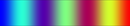](https://www.ncl.ucar.edu/Document/Graphics/ColorTables/3gauss.shtml) n=254| 3saw<br>[](https://www.ncl.ucar.edu/Document/Graphics/ColorTables/3saw.shtml) n=254| cb_9step<br>[](https://www.ncl.ucar.edu/Document/Graphics/ColorTables/cb_9step.shtml) n=78| detail<br>[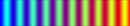](https://www.ncl.ucar.edu/Document/Graphics/ColorTables/detail.shtml) n=254|
| ------------------------------------------------------------ | ------------------------------------------------------------ | ------------------------------------------------------------ | ------------------------------------------------------------ |
| extrema<br>[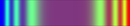](https://www.ncl.ucar.edu/Document/Graphics/ColorTables/extrema.shtml) n=254| matlab_lines<br>[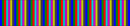](https://www.ncl.ucar.edu/Document/Graphics/ColorTables/matlab_lines.shtml) n=64| MPL_StepSeq<br>[](https://www.ncl.ucar.edu/Document/Graphics/ColorTables/MPL_StepSeq.shtml) n=128| NCV_banded<br>[](https://www.ncl.ucar.edu/Document/Graphics/ColorTables/NCV_banded.shtml) n=256|
| NCV_manga<br>[](https://www.ncl.ucar.edu/Document/Graphics/ColorTables/NCV_manga.shtml) n=256| NCV_roullet<br>[](https://www.ncl.ucar.edu/Document/Graphics/ColorTables/NCV_roullet.shtml) n=256| psgcap<br>[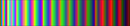](https://www.ncl.ucar.edu/Document/Graphics/ColorTables/psgcap.shtml) n=238| StepSeq25<br>[](https://www.ncl.ucar.edu/Document/Graphics/ColorTables/StepSeq25.shtml) n=25|
| SVG_Gallet13<br>[](https://www.ncl.ucar.edu/Document/Graphics/ColorTables/SVG_Gallet13.shtml) n=220| SVG_Lindaa06<br>[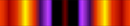](https://www.ncl.ucar.edu/Document/Graphics/ColorTables/SVG_Lindaa06.shtml) n=220| SVG_Lindaa07<br>[](https://www.ncl.ucar.edu/Document/Graphics/ColorTables/SVG_Lindaa07.shtml) n=220| uniform<br>[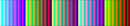](https://www.ncl.ucar.edu/Document/Graphics/ColorTables/uniform.shtml) n=173|


## Faded 

| CBR_set3<br>[](https://www.ncl.ucar.edu/Document/Graphics/ColorTables/CBR_set3.shtml) n=12| GMT_topo<br>[](https://www.ncl.ucar.edu/Document/Graphics/ColorTables/GMT_topo.shtml) n=256| MPL_Accent<br>[](https://www.ncl.ucar.edu/Document/Graphics/ColorTables/MPL_Accent.shtml) n=128| MPL_Dark2<br>[](https://www.ncl.ucar.edu/Document/Graphics/ColorTables/MPL_Dark2.shtml) n=128|
| ------------------------------------------------------------ | ------------------------------------------------------------ | ------------------------------------------------------------ | ------------------------------------------------------------ |
| MPL_Paired<br>[](https://www.ncl.ucar.edu/Document/Graphics/ColorTables/MPL_Paired.shtml) n=128| MPL_Pastel1<br>[](https://www.ncl.ucar.edu/Document/Graphics/ColorTables/MPL_Pastel1.shtml) n=128| MPL_Pastel2<br>[](https://www.ncl.ucar.edu/Document/Graphics/ColorTables/MPL_Pastel2.shtml) n=128| MPL_Set1<br>[](https://www.ncl.ucar.edu/Document/Graphics/ColorTables/MPL_Set1.shtml) n=128|
| MPL_Set2<br>[](https://www.ncl.ucar.edu/Document/Graphics/ColorTables/MPL_Set2.shtml) n=128| MPL_Set3<br>[](https://www.ncl.ucar.edu/Document/Graphics/ColorTables/MPL_Set3.shtml) n=128| SVG_feb_sunrise<br>[](https://www.ncl.ucar.edu/Document/Graphics/ColorTables/SVG_feb_sunrise.shtml) n=220| SVG_foggy_sunrise<br>[](https://www.ncl.ucar.edu/Document/Graphics/ColorTables/SVG_foggy_sunrise.shtml) n=220|


## Circular 

| circular_0<br>[](https://www.ncl.ucar.edu/Document/Graphics/ColorTables/circular_0.shtml) n=18| circular_1<br>[](https://www.ncl.ucar.edu/Document/Graphics/ColorTables/circular_1.shtml) n=12| circular_2<br>[](https://www.ncl.ucar.edu/Document/Graphics/ColorTables/circular_2.shtml) n=24| cmocean_phase<br>[](https://www.ncl.ucar.edu/Document/Graphics/ColorTables/cmocean_phase.shtml) n=256|
| ------------------------------------------------------------ | ------------------------------------------------------------ | ------------------------------------------------------------ | ------------------------------------------------------------ |
| GrayWhiteGray<br>[](https://www.ncl.ucar.edu/Document/Graphics/ColorTables/GrayWhiteGray.shtml) n=254| matlab_lines<br>[](https://www.ncl.ucar.edu/Document/Graphics/ColorTables/matlab_lines.shtml) n=64|                                                              |                                                              |


## Miscellaneous 

| default<br>[](https://www.ncl.ucar.edu/Document/Graphics/ColorTables/default.shtml) n=30| helix<br>[](https://www.ncl.ucar.edu/Document/Graphics/ColorTables/helix.shtml) n=254| hlu_default<br>[](https://www.ncl.ucar.edu/Document/Graphics/ColorTables/hlu_default.shtml) n=30| lithology<br>[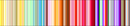](https://www.ncl.ucar.edu/Document/Graphics/ColorTables/lithology.shtml) n=213|
| ------------------------------------------------------------ | ------------------------------------------------------------ | ------------------------------------------------------------ | ------------------------------------------------------------ |
| thelix<br>[](https://www.ncl.ucar.edu/Document/Graphics/ColorTables/thelix.shtml) n=254|                                                              |                                                              |                                                              |

## Vegetation 

| MPL_BrBG<br>[](https://www.ncl.ucar.edu/Document/Graphics/ColorTables/MPL_BrBG.shtml) n=128| NEO_div_vegetation_a<br>[](https://www.ncl.ucar.edu/Document/Graphics/ColorTables/NEO_div_vegetation_a.shtml) n=256| NEO_div_vegetation_b<br>[](https://www.ncl.ucar.edu/Document/Graphics/ColorTables/NEO_div_vegetation_b.shtml) n=256| NEO_div_vegetation_c<br>[](https://www.ncl.ucar.edu/Document/Graphics/ColorTables/NEO_div_vegetation_c.shtml) n=256|
| ------------------------------------------------------------ | ------------------------------------------------------------ | ------------------------------------------------------------ | ------------------------------------------------------------ |
| NEO_modis_ndvi<br>[](https://www.ncl.ucar.edu/Document/Graphics/ColorTables/NEO_modis_ndvi.shtml) n=256| NOC_ndvi<br>[](https://www.ncl.ucar.edu/Document/Graphics/ColorTables/NOC_ndvi.shtml) n=253| vegetation_ClarkU<br>[](https://www.ncl.ucar.edu/Document/Graphics/ColorTables/vegetation_ClarkU.shtml) n=256| vegetation_modis<br>[](https://www.ncl.ucar.edu/Document/Graphics/ColorTables/vegetation_modis.shtml) n=21|


## White-in-the-middle 

| BlAqGrWh2YeOrReVi22<br>[](https://www.ncl.ucar.edu/Document/Graphics/ColorTables/BlAqGrWh2YeOrReVi22.shtml) n=22| BlueDarkRed18<br>[](https://www.ncl.ucar.edu/Document/Graphics/ColorTables/BlueDarkRed18.shtml) n=18| BlueWhiteOrangeRed<br>[](https://www.ncl.ucar.edu/Document/Graphics/ColorTables/BlueWhiteOrangeRed.shtml) n=254| BlWhRe<br>[](https://www.ncl.ucar.edu/Document/Graphics/ColorTables/BlWhRe.shtml) n=101|
| ------------------------------------------------------------ | ------------------------------------------------------------ | ------------------------------------------------------------ | ------------------------------------------------------------ |
| CBR_coldhot<br>[](https://www.ncl.ucar.edu/Document/Graphics/ColorTables/CBR_coldhot.shtml) n=11| CBR_drywet<br>[](https://www.ncl.ucar.edu/Document/Graphics/ColorTables/CBR_drywet.shtml) n=11| circular_0<br>[](https://www.ncl.ucar.edu/Document/Graphics/ColorTables/circular_0.shtml) n=18| cmocean_balance<br>[](https://www.ncl.ucar.edu/Document/Graphics/ColorTables/cmocean_balance.shtml) n=256|
| cmocean_curl<br>[](https://www.ncl.ucar.edu/Document/Graphics/ColorTables/cmocean_curl.shtml) n=256| cmp_flux<br>[](https://www.ncl.ucar.edu/Document/Graphics/ColorTables/cmp_flux.shtml) n=22| GMT_polar<br>[](https://www.ncl.ucar.edu/Document/Graphics/ColorTables/GMT_polar.shtml) n=20| GMT_red2green<br>[](https://www.ncl.ucar.edu/Document/Graphics/ColorTables/GMT_red2green.shtml) n=20|
| GrayWhiteGray<br>[](https://www.ncl.ucar.edu/Document/Graphics/ColorTables/GrayWhiteGray.shtml) n=254| GreenMagenta16<br>[](https://www.ncl.ucar.edu/Document/Graphics/ColorTables/GreenMagenta16.shtml) n=16| hotcold_18lev<br>[](https://www.ncl.ucar.edu/Document/Graphics/ColorTables/hotcold_18lev.shtml) n=19| hotcolr_19lev<br>[](https://www.ncl.ucar.edu/Document/Graphics/ColorTables/hotcolr_19lev.shtml) n=20|
| MPL_BrBG<br>[](https://www.ncl.ucar.edu/Document/Graphics/ColorTables/MPL_BrBG.shtml) n=128| MPL_bwr<br>[](https://www.ncl.ucar.edu/Document/Graphics/ColorTables/MPL_bwr.shtml) n=128| MPL_PiYG<br>[](https://www.ncl.ucar.edu/Document/Graphics/ColorTables/MPL_PiYG.shtml) n=128| MPL_PRGn<br>[](https://www.ncl.ucar.edu/Document/Graphics/ColorTables/MPL_PRGn.shtml) n=128|
| MPL_PuOr<br>[](https://www.ncl.ucar.edu/Document/Graphics/ColorTables/MPL_PuOr.shtml) n=128| MPL_RdBu<br>[](https://www.ncl.ucar.edu/Document/Graphics/ColorTables/MPL_RdBu.shtml) n=128| MPL_RdGy<br>[](https://www.ncl.ucar.edu/Document/Graphics/ColorTables/MPL_RdGy.shtml) n=128| MPL_seismic<br>[](https://www.ncl.ucar.edu/Document/Graphics/ColorTables/MPL_seismic.shtml) n=128|
| NCV_blu_red<br>[](https://www.ncl.ucar.edu/Document/Graphics/ColorTables/NCV_blu_red.shtml) n=256| NCV_blue_red<br>[](https://www.ncl.ucar.edu/Document/Graphics/ColorTables/NCV_blue_red.shtml) n=256| NCV_jaisnd<br>[](https://www.ncl.ucar.edu/Document/Graphics/ColorTables/NCV_jaisnd.shtml) n=256| NCV_manga<br>[](https://www.ncl.ucar.edu/Document/Graphics/ColorTables/NCV_manga.shtml) n=256|
| NCV_roullet<br>[](https://www.ncl.ucar.edu/Document/Graphics/ColorTables/NCV_roullet.shtml) n=256| NEO_div_vegetation_b<br>[](https://www.ncl.ucar.edu/Document/Graphics/ColorTables/NEO_div_vegetation_b.shtml) n=256| NEO_div_vegetation_c<br>[](https://www.ncl.ucar.edu/Document/Graphics/ColorTables/NEO_div_vegetation_c.shtml) n=256| nrl_sirkes<br>[](https://www.ncl.ucar.edu/Document/Graphics/ColorTables/nrl_sirkes.shtml) n=21|
| precip4_diff_19lev<br>[](https://www.ncl.ucar.edu/Document/Graphics/ColorTables/precip4_diff_19lev.shtml) n=20| precip_diff_12lev<br>[](https://www.ncl.ucar.edu/Document/Graphics/ColorTables/precip_diff_12lev.shtml) n=13| sunshine_diff_12lev<br>[](https://www.ncl.ucar.edu/Document/Graphics/ColorTables/sunshine_diff_12lev.shtml) n=13| temp_19lev<br>[](https://www.ncl.ucar.edu/Document/Graphics/ColorTables/temp_19lev.shtml) n=20|
| temp_diff_18lev<br>[](https://www.ncl.ucar.edu/Document/Graphics/ColorTables/temp_diff_18lev.shtml) n=19| testcmap<br>[](https://www.ncl.ucar.edu/Document/Graphics/ColorTables/testcmap.shtml) n=199| ViBlGrWhYeOrRe<br>[](https://www.ncl.ucar.edu/Document/Graphics/ColorTables/ViBlGrWhYeOrRe.shtml) n=101|                                                              |


## Starts-with-white 

| CBR_wet<br>[](https://www.ncl.ucar.edu/Document/Graphics/ColorTables/CBR_wet.shtml) n=11| mch_default<br>[](https://www.ncl.ucar.edu/Document/Graphics/ColorTables/mch_default.shtml) n=15| posneg_1<br>[](https://www.ncl.ucar.edu/Document/Graphics/ColorTables/posneg_1.shtml) n=19| posneg_2<br>[](https://www.ncl.ucar.edu/Document/Graphics/ColorTables/posneg_2.shtml) n=20|
| ------------------------------------------------------------ | ------------------------------------------------------------ | ------------------------------------------------------------ | ------------------------------------------------------------ |
| prcp_1<br>[](https://www.ncl.ucar.edu/Document/Graphics/ColorTables/prcp_1.shtml) n=17| prcp_3<br>[](https://www.ncl.ucar.edu/Document/Graphics/ColorTables/prcp_3.shtml) n=23| precip2_15lev<br>[](https://www.ncl.ucar.edu/Document/Graphics/ColorTables/precip2_15lev.shtml) n=16| precip2_17lev<br>[](https://www.ncl.ucar.edu/Document/Graphics/ColorTables/precip2_17lev.shtml) n=18|
| precip3_16lev<br>[](https://www.ncl.ucar.edu/Document/Graphics/ColorTables/precip3_16lev.shtml) n=17| precip_11lev<br>[](https://www.ncl.ucar.edu/Document/Graphics/ColorTables/precip_11lev.shtml) n=12| spread_15lev<br>[](https://www.ncl.ucar.edu/Document/Graphics/ColorTables/spread_15lev.shtml) n=16| sunshine_9lev<br>[](https://www.ncl.ucar.edu/Document/Graphics/ColorTables/sunshine_9lev.shtml) n=10|
| wh-bl-gr-ye-re<br>[](https://www.ncl.ucar.edu/Document/Graphics/ColorTables/wh-bl-gr-ye-re.shtml) n=199| WhBlGrYeRe<br>[](https://www.ncl.ucar.edu/Document/Graphics/ColorTables/WhBlGrYeRe.shtml) n=100| WhBlReWh<br>[](https://www.ncl.ucar.edu/Document/Graphics/ColorTables/WhBlReWh.shtml) n=100| WhiteBlue<br>[](https://www.ncl.ucar.edu/Document/Graphics/ColorTables/WhiteBlue.shtml) n=254|
| WhiteBlueGreenYellowRed<br>[](https://www.ncl.ucar.edu/Document/Graphics/ColorTables/WhiteBlueGreenYellowRed.shtml) n=254| WhiteGreen<br>[](https://www.ncl.ucar.edu/Document/Graphics/ColorTables/WhiteGreen.shtml) n=254| WhiteYellowOrangeRed<br>[](https://www.ncl.ucar.edu/Document/Graphics/ColorTables/WhiteYellowOrangeRed.shtml) n=254| WhViBlGrYeOrRe<br>[](https://www.ncl.ucar.edu/Document/Graphics/ColorTables/WhViBlGrYeOrRe.shtml) n=101|
| WhViBlGrYeOrReWh<br>[](https://www.ncl.ucar.edu/Document/Graphics/ColorTables/WhViBlGrYeOrReWh.shtml) n=101| wind_17lev<br>[](https://www.ncl.ucar.edu/Document/Graphics/ColorTables/wind_17lev.shtml) n=18|                                                              |                                                              |


## [GMT](http://gmt.soest.hawaii.edu/) 

| GMT_cool<br>[](https://www.ncl.ucar.edu/Document/Graphics/ColorTables/GMT_cool.shtml) n=10| GMT_copper<br>[](https://www.ncl.ucar.edu/Document/Graphics/ColorTables/GMT_copper.shtml) n=50| GMT_drywet<br>[](https://www.ncl.ucar.edu/Document/Graphics/ColorTables/GMT_drywet.shtml) n=60| GMT_gebco<br>[](https://www.ncl.ucar.edu/Document/Graphics/ColorTables/GMT_gebco.shtml) n=70|
| ------------------------------------------------------------ | ------------------------------------------------------------ | ------------------------------------------------------------ | ------------------------------------------------------------ |
| GMT_globe<br>[](https://www.ncl.ucar.edu/Document/Graphics/ColorTables/GMT_globe.shtml) n=256| GMT_gray<br>[](https://www.ncl.ucar.edu/Document/Graphics/ColorTables/GMT_gray.shtml) n=10| GMT_haxby<br>[](https://www.ncl.ucar.edu/Document/Graphics/ColorTables/GMT_haxby.shtml) n=32| GMT_hot<br>[](https://www.ncl.ucar.edu/Document/Graphics/ColorTables/GMT_hot.shtml) n=100|
| GMT_jet<br>[](https://www.ncl.ucar.edu/Document/Graphics/ColorTables/GMT_jet.shtml) n=256| GMT_nighttime<br>[](https://www.ncl.ucar.edu/Document/Graphics/ColorTables/GMT_nighttime.shtml) n=20| GMT_no_green<br>[](https://www.ncl.ucar.edu/Document/Graphics/ColorTables/GMT_no_green.shtml) n=16| GMT_ocean<br>[](https://www.ncl.ucar.edu/Document/Graphics/ColorTables/GMT_ocean.shtml) n=80|
| GMT_paired<br>[](https://www.ncl.ucar.edu/Document/Graphics/ColorTables/GMT_paired.shtml) n=12| GMT_panoply<br>[](https://www.ncl.ucar.edu/Document/Graphics/ColorTables/GMT_panoply.shtml) n=16| GMT_polar<br>[](https://www.ncl.ucar.edu/Document/Graphics/ColorTables/GMT_polar.shtml) n=20| GMT_red2green<br>[](https://www.ncl.ucar.edu/Document/Graphics/ColorTables/GMT_red2green.shtml) n=20|
| GMT_relief<br>[](https://www.ncl.ucar.edu/Document/Graphics/ColorTables/GMT_relief.shtml) n=256| GMT_relief_oceanonly<br>[](https://www.ncl.ucar.edu/Document/Graphics/ColorTables/GMT_relief_oceanonly.shtml) n=160| GMT_seis<br>[](https://www.ncl.ucar.edu/Document/Graphics/ColorTables/GMT_seis.shtml) n=256| GMT_split<br>[](https://www.ncl.ucar.edu/Document/Graphics/ColorTables/GMT_split.shtml) n=40|
| GMT_topo<br>[](https://www.ncl.ucar.edu/Document/Graphics/ColorTables/GMT_topo.shtml) n=256| GMT_wysiwyg<br>[](https://www.ncl.ucar.edu/Document/Graphics/ColorTables/GMT_wysiwyg.shtml) n=20| GMT_wysiwygcont<br>[](https://www.ncl.ucar.edu/Document/Graphics/ColorTables/GMT_wysiwygcont.shtml) n=200|                                                              |


## [GrADS](http://www.iges.org/grads/) 

| grads_default<br>[](https://www.ncl.ucar.edu/Document/Graphics/ColorTables/grads_default.shtml) n=14| grads_rainbow<br>[](https://www.ncl.ucar.edu/Document/Graphics/ColorTables/grads_rainbow.shtml) n=13|
| ------------------------------------------------------------ | ------------------------------------------------------------ |
|                                                              |                                                              |

## [matplotlib](http://matplotlib.org/) 

| MPL_Accent<br>[](https://www.ncl.ucar.edu/Document/Graphics/ColorTables/MPL_Accent.shtml) n=128| MPL_afmhot<br>[](https://www.ncl.ucar.edu/Document/Graphics/ColorTables/MPL_afmhot.shtml) n=128| MPL_autumn<br>[](https://www.ncl.ucar.edu/Document/Graphics/ColorTables/MPL_autumn.shtml) n=128| MPL_Blues<br>[](https://www.ncl.ucar.edu/Document/Graphics/ColorTables/MPL_Blues.shtml) n=128|
| ------------------------------------------------------------ | ------------------------------------------------------------ | ------------------------------------------------------------ | ------------------------------------------------------------ |
| MPL_bone<br>[](https://www.ncl.ucar.edu/Document/Graphics/ColorTables/MPL_bone.shtml) n=128| MPL_BrBG<br>[](https://www.ncl.ucar.edu/Document/Graphics/ColorTables/MPL_BrBG.shtml) n=128| MPL_brg<br>[](https://www.ncl.ucar.edu/Document/Graphics/ColorTables/MPL_brg.shtml) n=128| MPL_BuGn<br>[](https://www.ncl.ucar.edu/Document/Graphics/ColorTables/MPL_BuGn.shtml) n=128|
| MPL_BuPu<br>[](https://www.ncl.ucar.edu/Document/Graphics/ColorTables/MPL_BuPu.shtml) n=128| MPL_bwr<br>[](https://www.ncl.ucar.edu/Document/Graphics/ColorTables/MPL_bwr.shtml) n=128| MPL_cool<br>[](https://www.ncl.ucar.edu/Document/Graphics/ColorTables/MPL_cool.shtml) n=128| MPL_coolwarm<br>[](https://www.ncl.ucar.edu/Document/Graphics/ColorTables/MPL_coolwarm.shtml) n=128|
| MPL_copper<br>[](https://www.ncl.ucar.edu/Document/Graphics/ColorTables/MPL_copper.shtml) n=128| MPL_cubehelix<br>[](https://www.ncl.ucar.edu/Document/Graphics/ColorTables/MPL_cubehelix.shtml) n=128| MPL_Dark2<br>[](https://www.ncl.ucar.edu/Document/Graphics/ColorTables/MPL_Dark2.shtml) n=128| MPL_flag<br>[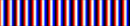](https://www.ncl.ucar.edu/Document/Graphics/ColorTables/MPL_flag.shtml) n=128|
| MPL_gist_earth<br>[](https://www.ncl.ucar.edu/Document/Graphics/ColorTables/MPL_gist_earth.shtml) n=128| MPL_gist_gray<br>[](https://www.ncl.ucar.edu/Document/Graphics/ColorTables/MPL_gist_gray.shtml) n=128| MPL_gist_heat<br>[](https://www.ncl.ucar.edu/Document/Graphics/ColorTables/MPL_gist_heat.shtml) n=128| MPL_gist_ncar<br>[](https://www.ncl.ucar.edu/Document/Graphics/ColorTables/MPL_gist_ncar.shtml) n=128|
| MPL_gist_rainbow<br>[](https://www.ncl.ucar.edu/Document/Graphics/ColorTables/MPL_gist_rainbow.shtml) n=128| MPL_gist_stern<br>[](https://www.ncl.ucar.edu/Document/Graphics/ColorTables/MPL_gist_stern.shtml) n=128| MPL_gist_yarg<br>[](https://www.ncl.ucar.edu/Document/Graphics/ColorTables/MPL_gist_yarg.shtml) n=128| MPL_GnBu<br>[](https://www.ncl.ucar.edu/Document/Graphics/ColorTables/MPL_GnBu.shtml) n=128|
| MPL_gnuplot<br>[](https://www.ncl.ucar.edu/Document/Graphics/ColorTables/MPL_gnuplot.shtml) n=128| MPL_gnuplot2<br>[](https://www.ncl.ucar.edu/Document/Graphics/ColorTables/MPL_gnuplot2.shtml) n=128| MPL_Greens<br>[](https://www.ncl.ucar.edu/Document/Graphics/ColorTables/MPL_Greens.shtml) n=128| MPL_Greys<br>[](https://www.ncl.ucar.edu/Document/Graphics/ColorTables/MPL_Greys.shtml) n=128|
| MPL_hot<br>[](https://www.ncl.ucar.edu/Document/Graphics/ColorTables/MPL_hot.shtml) n=128| MPL_hsv<br>[](https://www.ncl.ucar.edu/Document/Graphics/ColorTables/MPL_hsv.shtml) n=128| MPL_jet<br>[](https://www.ncl.ucar.edu/Document/Graphics/ColorTables/MPL_jet.shtml) n=128| MPL_ocean<br>[](https://www.ncl.ucar.edu/Document/Graphics/ColorTables/MPL_ocean.shtml) n=128|
| MPL_Oranges<br>[](https://www.ncl.ucar.edu/Document/Graphics/ColorTables/MPL_Oranges.shtml) n=128| MPL_OrRd<br>[](https://www.ncl.ucar.edu/Document/Graphics/ColorTables/MPL_OrRd.shtml) n=128| MPL_Paired<br>[](https://www.ncl.ucar.edu/Document/Graphics/ColorTables/MPL_Paired.shtml) n=128| MPL_Pastel1<br>[](https://www.ncl.ucar.edu/Document/Graphics/ColorTables/MPL_Pastel1.shtml) n=128|
| MPL_Pastel2<br>[](https://www.ncl.ucar.edu/Document/Graphics/ColorTables/MPL_Pastel2.shtml) n=128| MPL_pink<br>[](https://www.ncl.ucar.edu/Document/Graphics/ColorTables/MPL_pink.shtml) n=128| MPL_PiYG<br>[](https://www.ncl.ucar.edu/Document/Graphics/ColorTables/MPL_PiYG.shtml) n=128| MPL_PRGn<br>[](https://www.ncl.ucar.edu/Document/Graphics/ColorTables/MPL_PRGn.shtml) n=128|
| MPL_prism<br>[](https://www.ncl.ucar.edu/Document/Graphics/ColorTables/MPL_prism.shtml) n=128| MPL_PuBu<br>[](https://www.ncl.ucar.edu/Document/Graphics/ColorTables/MPL_PuBu.shtml) n=128| MPL_PuBuGn<br>[](https://www.ncl.ucar.edu/Document/Graphics/ColorTables/MPL_PuBuGn.shtml) n=128| MPL_PuOr<br>[](https://www.ncl.ucar.edu/Document/Graphics/ColorTables/MPL_PuOr.shtml) n=128|
| MPL_PuRd<br>[](https://www.ncl.ucar.edu/Document/Graphics/ColorTables/MPL_PuRd.shtml) n=128| MPL_Purples<br>[](https://www.ncl.ucar.edu/Document/Graphics/ColorTables/MPL_Purples.shtml) n=128| MPL_rainbow<br>[](https://www.ncl.ucar.edu/Document/Graphics/ColorTables/MPL_rainbow.shtml) n=128| MPL_RdBu<br>[](https://www.ncl.ucar.edu/Document/Graphics/ColorTables/MPL_RdBu.shtml) n=128|
| MPL_RdGy<br>[](https://www.ncl.ucar.edu/Document/Graphics/ColorTables/MPL_RdGy.shtml) n=128| MPL_RdPu<br>[](https://www.ncl.ucar.edu/Document/Graphics/ColorTables/MPL_RdPu.shtml) n=128| MPL_RdYlBu<br>[](https://www.ncl.ucar.edu/Document/Graphics/ColorTables/MPL_RdYlBu.shtml) n=128| MPL_RdYlGn<br>[](https://www.ncl.ucar.edu/Document/Graphics/ColorTables/MPL_RdYlGn.shtml) n=128|
| MPL_Reds<br>[](https://www.ncl.ucar.edu/Document/Graphics/ColorTables/MPL_Reds.shtml) n=128| MPL_s3pcpn<br>[](https://www.ncl.ucar.edu/Document/Graphics/ColorTables/MPL_s3pcpn.shtml) n=128| MPL_s3pcpn_l<br>[](https://www.ncl.ucar.edu/Document/Graphics/ColorTables/MPL_s3pcpn_l.shtml) n=128| MPL_seismic<br>[](https://www.ncl.ucar.edu/Document/Graphics/ColorTables/MPL_seismic.shtml) n=128|
| MPL_Set1<br>[](https://www.ncl.ucar.edu/Document/Graphics/ColorTables/MPL_Set1.shtml) n=128| MPL_Set2<br>[](https://www.ncl.ucar.edu/Document/Graphics/ColorTables/MPL_Set2.shtml) n=128| MPL_Set3<br>[](https://www.ncl.ucar.edu/Document/Graphics/ColorTables/MPL_Set3.shtml) n=128| MPL_Spectral<br>[](https://www.ncl.ucar.edu/Document/Graphics/ColorTables/MPL_Spectral.shtml) n=128|
| MPL_spring<br>[](https://www.ncl.ucar.edu/Document/Graphics/ColorTables/MPL_spring.shtml) n=128| MPL_sstanom<br>[](https://www.ncl.ucar.edu/Document/Graphics/ColorTables/MPL_sstanom.shtml) n=128| MPL_StepSeq<br>[](https://www.ncl.ucar.edu/Document/Graphics/ColorTables/MPL_StepSeq.shtml) n=128| MPL_summer<br>[](https://www.ncl.ucar.edu/Document/Graphics/ColorTables/MPL_summer.shtml) n=128|
| MPL_terrain<br>[](https://www.ncl.ucar.edu/Document/Graphics/ColorTables/MPL_terrain.shtml) n=128| MPL_viridis<br>[](https://www.ncl.ucar.edu/Document/Graphics/ColorTables/MPL_viridis.shtml) n=256| MPL_winter<br>[](https://www.ncl.ucar.edu/Document/Graphics/ColorTables/MPL_winter.shtml) n=128| MPL_YlGn<br>[](https://www.ncl.ucar.edu/Document/Graphics/ColorTables/MPL_YlGn.shtml) n=128|
| MPL_YlGnBu<br>[](https://www.ncl.ucar.edu/Document/Graphics/ColorTables/MPL_YlGnBu.shtml) n=128| MPL_YlOrBr<br>[](https://www.ncl.ucar.edu/Document/Graphics/ColorTables/MPL_YlOrBr.shtml) n=128| MPL_YlOrRd<br>[](https://www.ncl.ucar.edu/Document/Graphics/ColorTables/MPL_YlOrRd.shtml) n=128|                                                              |


## [Ncview](http://meteora.ucsd.edu/~pierce/ncview_home_page.html) 

| NCV_banded<br>[](https://www.ncl.ucar.edu/Document/Graphics/ColorTables/NCV_banded.shtml) n=256| NCV_blu_red<br>[](https://www.ncl.ucar.edu/Document/Graphics/ColorTables/NCV_blu_red.shtml) n=256| NCV_blue_red<br>[](https://www.ncl.ucar.edu/Document/Graphics/ColorTables/NCV_blue_red.shtml) n=256| NCV_bright<br>[](https://www.ncl.ucar.edu/Document/Graphics/ColorTables/NCV_bright.shtml) n=256|
| ------------------------------------------------------------ | ------------------------------------------------------------ | ------------------------------------------------------------ | ------------------------------------------------------------ |
| NCV_gebco<br>[](https://www.ncl.ucar.edu/Document/Graphics/ColorTables/NCV_gebco.shtml) n=24| NCV_jaisnd<br>[](https://www.ncl.ucar.edu/Document/Graphics/ColorTables/NCV_jaisnd.shtml) n=256| NCV_jet<br>[](https://www.ncl.ucar.edu/Document/Graphics/ColorTables/NCV_jet.shtml) n=256| NCV_manga<br>[](https://www.ncl.ucar.edu/Document/Graphics/ColorTables/NCV_manga.shtml) n=256|
| NCV_rainbow2<br>[](https://www.ncl.ucar.edu/Document/Graphics/ColorTables/NCV_rainbow2.shtml) n=256| NCV_roullet<br>[](https://www.ncl.ucar.edu/Document/Graphics/ColorTables/NCV_roullet.shtml) n=256| ncview_default<br>[](https://www.ncl.ucar.edu/Document/Graphics/ColorTables/ncview_default.shtml) n=254|                                                              |


## SVG 

| SVG_bhw3_22<br>[](https://www.ncl.ucar.edu/Document/Graphics/ColorTables/SVG_bhw3_22.shtml) n=220| SVG_es_landscape_79<br>[](https://www.ncl.ucar.edu/Document/Graphics/ColorTables/SVG_es_landscape_79.shtml) n=220| SVG_feb_sunrise<br>[](https://www.ncl.ucar.edu/Document/Graphics/ColorTables/SVG_feb_sunrise.shtml) n=220| SVG_foggy_sunrise<br>[](https://www.ncl.ucar.edu/Document/Graphics/ColorTables/SVG_foggy_sunrise.shtml) n=220|
| ------------------------------------------------------------ | ------------------------------------------------------------ | ------------------------------------------------------------ | ------------------------------------------------------------ |
| SVG_fs2006<br>[](https://www.ncl.ucar.edu/Document/Graphics/ColorTables/SVG_fs2006.shtml) n=220| SVG_Gallet13<br>[](https://www.ncl.ucar.edu/Document/Graphics/ColorTables/SVG_Gallet13.shtml) n=220| SVG_Lindaa06<br>[](https://www.ncl.ucar.edu/Document/Graphics/ColorTables/SVG_Lindaa06.shtml) n=220| SVG_Lindaa07<br>[](https://www.ncl.ucar.edu/Document/Graphics/ColorTables/SVG_Lindaa07.shtml) n=220|


## [ColorBrewer](http://colorbrewer2.org/) 

| CBR_coldhot<br>[](https://www.ncl.ucar.edu/Document/Graphics/ColorTables/CBR_coldhot.shtml) n=11| CBR_drywet<br>[](https://www.ncl.ucar.edu/Document/Graphics/ColorTables/CBR_drywet.shtml) n=11| CBR_set3<br>[](https://www.ncl.ucar.edu/Document/Graphics/ColorTables/CBR_set3.shtml) n=12| CBR_wet<br>[](https://www.ncl.ucar.edu/Document/Graphics/ColorTables/CBR_wet.shtml) n=11|
| ------------------------------------------------------------ | ------------------------------------------------------------ | ------------------------------------------------------------ | ------------------------------------------------------------ |
|                                                              |                                                              |                                                              |                                                              |
